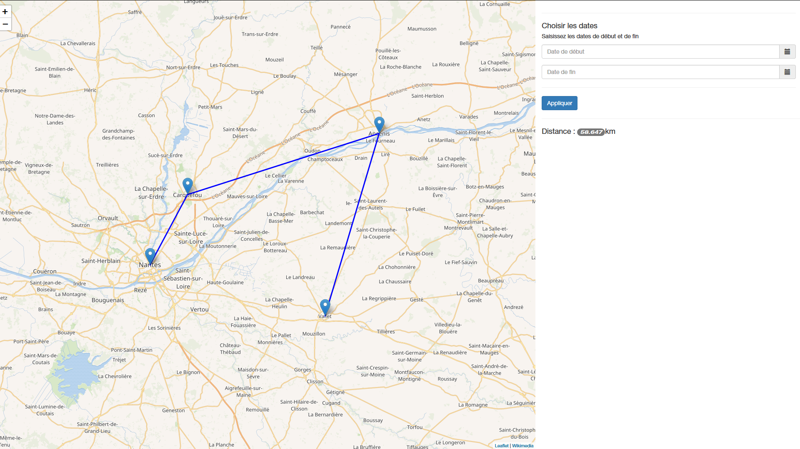
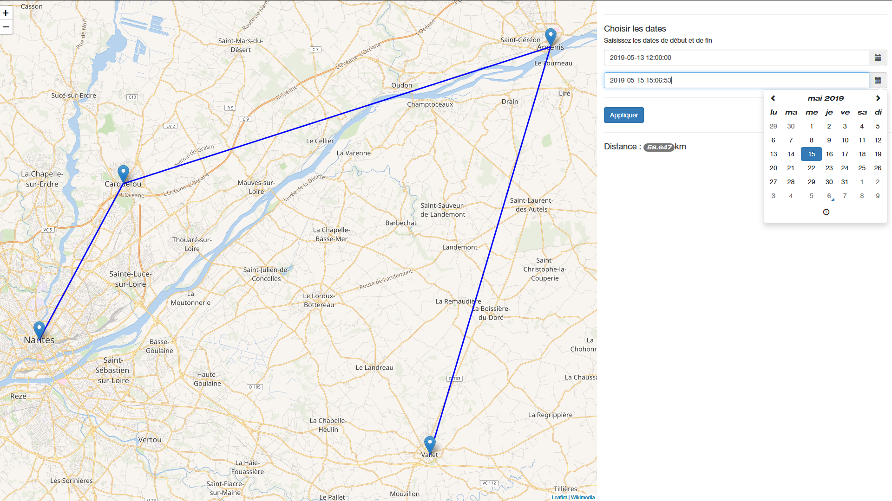
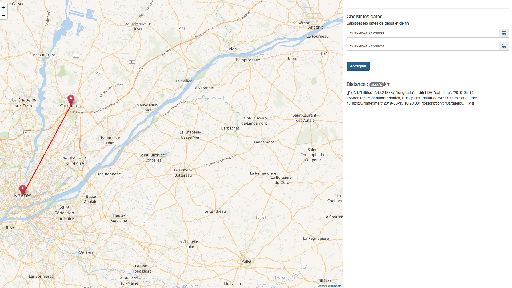

<p align="center">

</p>

<h1 align="center">:round_pushpin: Leaflet - Marker's Position & Distance :round_pushpin:</h1>

## Project overview
<p align="center">
  
</p>
<p align="center">
  
</p>
<p align="center">
  
</p>

## Installation :gear:

Clone this repository by taping this command in your CLI :

```bash
git clone https://github.com/MathisLeRoyNivot/Leaflet-Position
```

Or download the project.

## Testing phase

To test this plaform, first make sure you have already download Node.JS. If this is not the case, download [**Node.JS**](https://nodejs.org/en/) and follow the instructions. <br>
Then launch the server by typing the following command : 
```bash
node server.js
```

And then, enjoy the platform by clicking the following link : 
```bash
Server is running on port : 3000  
You can routing to the server at the following address : http://localhost:3000/  
The API is available at the following address : http://localhost:3000/api/coords 
```

## JSON File data

You can add / modify data into the *```gps-coord.json```* file available into the JS folder like the following pattern.

```json
{
    "id": <ID>,
    "lattitude": <Lattitude>,
    "longitude": <Longitude>,
    "datetime": "<YYYY-MM-DD HH:MM:ss>", 
    "description": "<Description>"
}
```

## Contributor :computer:
- [Mathis Le Roy-Nivot](https://github.com/MathisLeRoyNivot "Go to @MathisLeRoyNivot's Github")

## License :white_check_mark:
[](https://github.com/MathisLeRoyNivot/Leaflet-Position/blob/master/LICENSE) Mathis LE ROY-NIVOT 2019 ©
